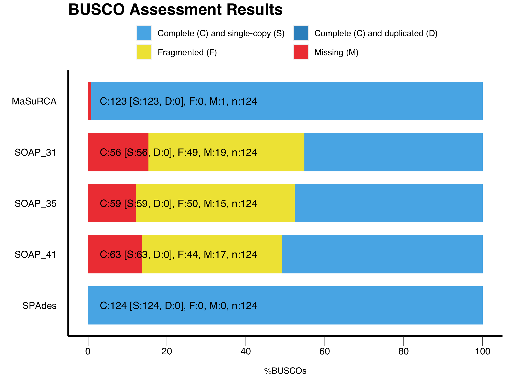

# Genome Assembly   

This repository is a usable, publicly available tutorial. All steps have been provided for the UConn CBC Xanadu cluster here with appropriate headers for the Slurm scheduler that can be modified simply to run.  Commands should never be executed on the submit nodes of any HPC machine.  If working on the Xanadu cluster, you should use sbatch scriptname after modifying the script for each stage.  Basic editing of all scripts can be performed on the server with tools such as nano, vim, or emacs.  If you are new to Linux, please use [this](https://bioinformatics.uconn.edu/unix-basics) handy guide for the operating system commands.  In this guide, you will be working with common bioinformatic file formats, such as [FASTA](https://en.wikipedia.org/wiki/FASTA_format), [FASTQ](https://en.wikipedia.org/wiki/FASTQ_format), [SAM/BAM](https://en.wikipedia.org/wiki/SAM_(file_format)), and [GFF3/GTF](https://en.wikipedia.org/wiki/General_feature_format). You can learn even more about each file format [here](https://bioinformatics.uconn.edu/resources-and-events/tutorials/file-formats-tutorial/). If you do not have a Xanadu account and are an affiliate of UConn/UCHC, please apply for one **[here](https://bioinformatics.uconn.edu/contact-us/)**.   

**Contents**    

1.   [Overview](#1-overview)  
2.   [Short Read Genome Assembly](#2-short-read-genome-assembly)
      1.  [Quality Control](#21--quality-control-using-sickl)  
	  2.  [Assembly](#22--assembly)   
	  3.  [Quality Assesment](#23--quality-assesment)  
3.   [Long Read Genome Assembly](#3-long-read-genome-assembly)  


## 1. Overview   
This tutorial will teach you how to use open source quality control, genome assembly, and assembly assessment tools to complete a high quality de novo assembly which is commonly utilized when you dont have a reference genome. Moving through the tutorial, you will take pair end short read data from a bacterial species and perform assemblies via various commonly used genome assmeblers. With these assemblies completed we will then need to assess the quality of the data produced. Once finished with the short read data we will move on to performing a long read assembly with long read nanopore data using basecalling and commonly used long read assemblers. Finally, we will then move on to Hybrid PacBio data.     


#### Structure of the tutorial   

The tutorial is organized into 3 parts:   
*   Short Read Assembly   
*   Long Read Assembly  
*   Hybrid Assembly   

Once you git clone the repository, you can see three main folders:  
```
Genome_Assembly/
├── short_read_assembly/
├── long_read_assembly/
└── hybrid_assembly/ 
```

#### SLURM scripts

 In each folder it will contain the scripts to run each job in the HPC cluster. The tutorial will be using SLURM schedular to submit jobs to Xanadu cluster. In each script we will be using it will contain a header section which will allocate the resources for the SLURM schedular. The header section will contain:   
```
#!/bin/bash
#SBATCH --job-name=JOBNAME
#SBATCH -n 1
#SBATCH -N 1
#SBATCH -c 1
#SBATCH --mem=1G
#SBATCH --partition=general
#SBATCH --qos=general
#SBATCH --mail-type=ALL
#SBATCH --mail-user=first.last@uconn.edu
#SBATCH -o %x_%j.out
#SBATCH -e %x_%j.err
```
Before beginning, we need to understand a few aspects of the Xanadu server. When first logging into Xanadu from your local terminal, you will be connected to the submit node. The submit node is the interface with which users on Xanadu may submit their processes to the desired compute nodes, which will run the process. Never, under any circumstance, run processes directly in the submit node. Your process will be killed and all of your work lost! This tutorial will not teach you shell script configuration to submit your tasks on Xanadu. Therefore, before moving on, read and master the topics covered in the [Xanadu tutorial](https://bioinformatics.uconn.edu/resources-and-events/tutorials-2/xanadu/).  


 ## 2. Short Read Genome Assembly   
 When using short reads for genome assembly, the reads first need to be quality controled, and then will be assembled. In this section we will be showing how to use three assemblers: [SOAPdenovo](https://github.com/aquaskyline/SOAPdenovo2), [SPAdes](https://github.com/ablab/spades) and [MaSuRCA](https://github.com/alekseyzimin/masurca) to assemble short reads and then how to evaluate the assembled reads.   

    

### 2.1  Quality Control using sickle  
**working directory**  
```
Genome_Assembly/
├── short_read_assembly/
       ├── 02_quality_control/
``` 
Sickle takes raw reads and outputs data with the 3’ and 5’ ends trimmed to assure that the quality of the read is high enough for assembly, it will also trim low quality reads.  

```bash
module load sickle/1.33

module load sickle/1.33

sickle pe \
	-f ../01_raw_reads/Sample_R1.fastq \
	-r ../01_raw_reads/Sample_R2.fastq \
	-t sanger \
	-o trim_Sample_R1.fastq \
	-p trim_Sample_R2.fastq \
	-s sinlges.fastq \
	-q 30 \
	-l 45 

module unload sickle/1.33
```  
The useage information on the sickle program:  
```
Usage: sickle pe [options] -f <paired-end forward fastq file> 
	-r <paired-end reverse fastq file> 
	-t <quality type> 
	-o <trimmed PE forward file> 
	-p <trimmed PE reverse file> 
	-s <trimmed singles file>    

Options:
-f, --pe-file1, Input paired-end forward fastq file
-r, --pe-file2, Input paired-end reverse fastq file
-o, --output-pe1, Output trimmed forward fastq file
-p, --output-pe2, Output trimmed reverse fastq file
-s                Singles files

Global options:
-t, --qual-type, Type of quality values
                solexa (CASAVA < 1.3)
                illumina (CASAVA 1.3 to 1.7)
                sanger (which is CASAVA >= 1.8)
-s, --output-single, Output trimmed singles fastq file
-l, --length-threshold, Threshold to keep a read based on length after trimming. Default 20
-q, --qual-threshold, Threshold for trimming based on average quality in a window. Default 20
```  
The full slurm script is called [sr_quality_control.sh](short_read_assembly/02_quality_control/sr_quality_control.sh) which can be found in the *02_quality_control/* folder.
Once you run the batch script using *sbatch* command, you will end up with the following files:   
```
02_quality_control/
├── trim_Sample_R1.fastq
├── trim_Sample_R2.fastq
└── sinlges.fastq
```  

### 2.2  Assembly  
#### 2.2a  Assembly with SOAPdenovo   
Working directory:  
```
short_read_assembly/
├── 03_assembly/
│   ├── SOAP/
```

[SOAP-denovo](https://www.animalgenome.org/bioinfo/resources/manuals/SOAP.html) is a short read de novo assembler. When you do deep sequencing, and have multiple libraries, they will produce multiple sequencing files. A configuration file will let the assembler know, where to find these files. In here we will provide you with a configuration file.    

The configuration file will have global information, and then multiple library sections. For global information, right now only *max_rd_len* is included. A read which is longer than this length will be cut to this length.  

Followed by the global information, the library information of sequencing data should be organized under [LIB] tag.   

Each libaray section will start with [LIB] tag: following are the items which it will include.   

*   **avg_ins** : average insert size of this library or the peak value position in the insert size distribution.   
*   **reverse_seq** : This option will take value 0 or 1. It tells the assembler if the read sequences need to be complementarily reversed. Illumima GA produces two types of paired-end libraries:   
    *   forward-reverse, generated from fragmented DNA ends with typical insert size less than 500 bp;
	*   forward-forward, generated from circularizing libraries with typical insert size greater than 2 Kb;   
	The parameter "reverse_seq" should be set to indicate this:   
	0, forward-reverse; 1, forward-forward.   

*   **asm_flags=3** : This indicator decides in which part(s) the reads are used. It takes value:    
    *    1 : only contig assembly 
	*    2 : only scaffold assembly   
	*    3 : both contig and scaffold assembly   
	*    4 : only gap closure    

*    **rd_len_cutoff** : The assembler will cut the reads from the current library to this length.   
*    **rank** : it takes integer values and decides in which order the reads are used for scaffold assembly. Libraries with the same "rank" are used at the same time during scaffold assembly.    
*    **pair_num_cutoff** : This parameter is the cutoff value of pair number for a reliable connection between two contigs or pre-scaffolds.   
*    **map_len** : This takes effect in the "map" step and is the minimun alignment length between a read and a contig required for a reliable read location.   

After the above tags the reads can be added in the following fashion:  
*   It will accept two formats: FASTA or FASTQ   
	*   single end files are indicated in **f=/path-to-file/** or **q=/path-to-file/** : FASTA / FASTQ   
	*   paired reads in two FASTA sequence files are indicated by: **f1=/path-to-file/**  and **f2=/path-to-file/**   
	*   paired reads in two fastq sequences files are indicated by: **q1=/path-to-file/** and **q2=/path-to-file/**   
	*   paired reads in a single fasta sequence file is indicated by **"p="**   

following is the configuration file we are using for our run:   

```bash
#Global
#maximal read length
max_rd_len=250
#Library
[LIB]
#average insert size
avg_ins=550
#if sequence needs to be reversed in our case its; forward-reverse
reverse_seq=0
#both contig and scaffold assembly parts of the reads are used
asm_flags=3
#use only first 250 bps of each read
rd_len_cutoff=250
#in which order the reads are used while scaffolding
rank=1
# cutoff of pair number for a reliable connection (at least 3 for short insert size)
pair_num_cutoff=3
#minimum aligned length to contigs for a reliable read location (at least 32 for short insert size)
map_len=32
#PATH to FASTQ reads 
q1=../../02_quality_control/trim_Sample_R1.fastq
q2=../../02_quality_control/trim_Sample_R2.fastq
q=../../02_quality_control/sinlges.fastq
```

The configuration file we created for this job is named as [config_file](short_read_assembly/03_assembly/config_file) and can be found in the **SOAP/** folder.   

Once the configuration file is ready, you can run the assembly job using the following command:   

```bash
module load SOAP-denovo/2.04

SOAPdenovo-63mer all \
	-s config_file \
	-K 31 \
	-p 8 \
	-R \
	-o graph_Sample_31 1>kmer31.log 2>kmer31.err 

SOAPdenovo-63mer all \
	-s config_file \
	-K 35 \
	-p 8 \
	-R \
	-o graph_Sample_35 1>kmer35.log 2>kmer35.err 

SOAPdenovo-63mer all \
	-s config_file \
	-K 41 \
	-p 8\
	-R \
	-o graph_Sample_41 1>kmer41.log 2>kmer41.err 
```

SOAPdenovo assembly options:   
```
 Usage: SOAPdenovo <command> [option]

all             do pregraph-contig-map-scaff in turn

  -s <string>    configFile: the config file
  
  -K <int>       kmer(min 13, max 63): kmer size
  -p <int>       n_cpu: number of cpu for use
  -R (optional)  resolve repeats by reads
  -o <string>    outputGraph: prefix of output graph file name     
 ```

> NOTE
> A k-mer is a set of nucleotides, k is the number of nucleotides in that set. It is a crucial parameter in most de Brujin Graph assemblers and assemblers work with the highest accuracy if the k-mer size estimation is accurate.

The above script is called [SOAPdenovo.sh](/short_read_assembly/03_assembly/SOAPdenovo.sh) and can be found in the SOAP/ directory. The script can be run using the `sbatch` command.  

It will produce bunch of files, and we are interested in the each k-mer scafold sequences produced, at the end of each run. These are the files which we will be used to asses the quality of our assembly.  


```
SOAP
├── graph_Sample_31.scafSeq
├── graph_Sample_35.scafSeq
└── graph_Sample_41.scafSeq
```   


#### 2.2b  Assembly with SPAdes   
Workding directory:
```
short_read_assembly/
└── 03_assembly/
    └── SPAdes/  
```

[SPAdes](http://cab.spbu.ru/software/spades/) - St. Petersburg genome assembler is a toolkit containing assembly pipelines. When SPAdes was initally designed it was for for small genonmes, like bacterial, fungal and other small genomes. SPAdes is not intened for larger genomes.SPAdes has different pipe-lines present and if you want to check them out please visit the [SPAdes web site](http://cab.spbu.ru/software/spades/) or its [git-hub site](https://github.com/ablab/spades/blob/spades_3.14.0/README.md).  

Instead of manually selecting k-mers, SPAdes automatically selects k-mers based off the maximum read length data of your input. This is a called a de Bruijn graph based assembler, meaning that it assigns (k-1)-mers to nodes and every possible matching prefix and suffix of these nodes are connected with a line.  


SPAdes takes as input paired-end reads, mate-pairs and single (unpaired) reads in FASTA and FASTQ. In here we are using paired-end reads and the left and right reads are held in two files and they will be taken into the assembler in the same order as in the files.  

Command line options we used:   
```bash
module load SPAdes/3.13.0

spades.py \
	-1 ../../02_quality_control/trim_Sample_R1.fastq \
	-2 ../../02_quality_control/trim_Sample_R2.fastq \
	-s ../../02_quality_control/sinlges.fastq \
	--careful \
	--threads 8 \
	--memory 30 \
	-o .
```

Basic SPAdes command line would look like:  
`spades.py [options] -o <output_dir>`   

where the options we used:
```
Input
-1	file with forward paired-end reads
-2	file with reverse paired-end reads
-s	file with unpaired reads

--careful    tries to reduce number of mismatches and short indels
--threads	 number of threads
--memory	 RAM limit for SPAdes in Gb (terminates if exceeded) defaul is 250
```  
> **NOTE**  
> its very important to make sure you match the number of theads and the memory asked in the options section is matched with the SLURM header part of your script.  

The full script for our SPAdes run is called [SPAdes.sh](/short_read_assembly/03_assembly/SPAdes/SPAdes.sh) and it can be found in the **03_assembly/SPAdes/** directory.  

Once the assembly script is ran, it will produce bunch of files together with the final scafold file which is called, scaffolds.fasta. We will be using this final scaffold file to analyze the SPAdes assembly run. 
```
SPAdes/
├── scaffolds.fasta
 
```


#### 2.2c Assembly with MaSuRCA   

Working directory will be:  
```
03_assembly/
├── MaSuRCA/
```
[MaSuRCA](https://github.com/alekseyzimin/masurca) (**Ma**ryland **Su**per **R**ead **C**abog **A**ssembler) is a combination of a De Bruijn graph and an Overlap-Layout-Consensus model. The Overlap-Layout-Consensus model consists of three steps, Overlap, which is the process of overlapping matching sequences in the data, this forms a long branched line. Layout, which is the process of picking the least branched line in from the overlap sequence created earlier, the final product here is called a contig. Consensus is the process of lining up all the contigs and picking out the most similar nucleotide line up in this set of sequences (OIRC).   

When running [MaSuRCA](http://www.genome.umd.edu/masurca.html), there are few things you should keep in mind. This assembler, **DOES NOT** require a preprocessing step, such as trimming, cleaning or error correction step; you will directly feed the raw reads.   

The first step is to create a configuration file. A sample file can be copied from the MaSuRCA instalation directory. The following command will copy it to your working folder.  
```bash
cp $MASURCA/sr_config_example.txt config_file
```  
The configuration file, will contain the location of the compiled assembler, the location of the data and some parameters. In most cases you only need to change the path to your read files.   

Second step is to run the masurca script which will create a shell script called `assembly.sh` using the configuration file.  

Then the final step is to run this `assembly.sh` script, which will create the scaffolds.   

Lets look at the configuration file, which contain two sections, DATA and PARAMERTERS, and each section concludes with END section.  

In the DATA section:
```bash
DATA
#Illumina paired end reads supplied as <two-character prefix> <fragment mean> <fragment stdev> <forward_reads> <reverse_reads> 
PE= pe 180 20  ../../01_raw_reads/Sample_R1.fastq ../../01_raw_reads/Sample_R2.fastq 
END
```   
DATA section is where you should specify the input data for the assembler. Each library line should with the appropiate read type, `eg: PE, JUMP, OTHER`.  In the above DATA section we have specified Illumina paired end reads.  
`PE = two_letter_prefix mean stdev /path-to-forward-read /path-to-reverse-read`   

 `mean` = is the library insert average length  
 `stdev` = is the stanard deviation. It this is not known set it as 15% of the `mean`. If the reverse read is not avaliable do not specify this.      
If you are interested in other types of reads and how to include them in the DATA section, more information can be found in the [MaSuRCA git page](https://github.com/alekseyzimin/masurca).  


In the PARAMETERS section:  
```bash
PARAMETERS
#PLEASE READ all comments to essential parameters below, and set the parameters according to your project
#set this to 1 if your Illumina jumping library reads are shorter than 100bp
EXTEND_JUMP_READS=0
#this is k-mer size for deBruijn graph values between 25 and 127 are supported, auto will compute the optimal size based on the read data and GC content
GRAPH_KMER_SIZE = auto
#set this to 1 for all Illumina-only assemblies
#set this to 0 if you have more than 15x coverage by long reads (Pacbio or Nanopore) or any other long reads/mate pairs (Illumina MP, Sanger, 454, etc)
USE_LINKING_MATES = 0
#specifies whether to run the assembly on the grid
USE_GRID=0
#specifies grid engine to use SGE or SLURM
GRID_ENGINE=SGE
#specifies queue (for SGE) or partition (for SLURM) to use when running on the grid MANDATORY
GRID_QUEUE=all.q
#batch size in the amount of long read sequence for each batch on the grid
GRID_BATCH_SIZE=500000000
#use at most this much coverage by the longest Pacbio or Nanopore reads, discard the rest of the reads
#can increase this to 30 or 35 if your reads are short (N50<7000bp)
LHE_COVERAGE=25
#set to 0 (default) to do two passes of mega-reads for slower, but higher quality assembly, otherwise set to 1
MEGA_READS_ONE_PASS=0
#this parameter is useful if you have too many Illumina jumping library mates. Typically set it to 60 for bacteria and 300 for the other organisms 
LIMIT_JUMP_COVERAGE = 300
#these are the additional parameters to Celera Assembler.  do not worry about performance, number or processors or batch sizes -- these are computed automatically. 
#CABOG ASSEMBLY ONLY: set cgwErrorRate=0.25 for bacteria and 0.1<=cgwErrorRate<=0.15 for other organisms.
CA_PARAMETERS =  cgwErrorRate=0.15
#CABOG ASSEMBLY ONLY: whether to attempt to close gaps in scaffolds with Illumina  or long read data
CLOSE_GAPS=1
#auto-detected number of cpus to use, set this to the number of CPUs/threads per node you will be using
NUM_THREADS = 16
#this is mandatory jellyfish hash size -- a safe value is estimated_genome_size*20
JF_SIZE = 200000000
#ILLUMINA ONLY. Set this to 1 to use SOAPdenovo contigging/scaffolding module.  Assembly will be worse but will run faster. Useful for very large (>=8Gbp) genomes from Illumina-only data
SOAP_ASSEMBLY=0
#Hybrid Illumina paired end + Nanopore/PacBio assembly ONLY.  Set this to 1 to use Flye assembler for final assembly of corrected mega-reads.  A lot faster than CABOG, at the expense of some contiguity. Works well even when MEGA_READS_ONE_PASS is set to 1.  DO NOT use if you have less than 15x coverage by long reads.
FLYE_ASSEMBLY=0
END
```

The full configuration file in our run is called [config_file](short_read_assembly/03_assembly/MaSuRCA/config_file) and it can be found in the MaSuRCA/ directory. Once the configuration file is set up you can run MaSuRCA using:
```bash
module load MaSuRCA/3.3.4 

masurca config_file

bash assemble.sh

module unload MaSuRCA/3.3.4
```

The full script for running MaSuRCA is called [MASuRCA.sh](short_read_assembly/03_assembly/MaSuRCA/MASuRCA.sh) and can be found in the 03_assembly/MaSuRCA/ folder.   

Final assembly scaffolds can be found under the **CA/** folder:  
```
MaSuRCA/
├── CA/
│   ├── final.genome.scf.fasta
```

## 2.3  Quality Assesment  

Once we have the contigs/scaffolds assembled, next step is to check the quality of these. In here we will use 4 methods to check, which will be depicted in the following:  

  


### 2.3.a Assembly Statistics with QUAST   

[QUAST](http://quast.sourceforge.net/quast) will be used to evaluate genome assemblies. We will be using the program QUAST which will give us the number of contigs, total length and N50 value; the data we are most interested in. A good assembly would have small number of contigs, a total length that makes sense for the specific species, and a large N50 value. N50 is a measure to describe the quality of assembled genomes fragmented in contigs of different length. The N50 is the minimum contig length needed to cover 50% of the genome.  

Working directory:  
```
short_read_assembly/
└── 04_quast
```


*   For SOAPdenovo scaffolds we will be using:  
```
module load quast/5.0.2

quast.py ../03_assembly/SOAP/graph_Sample_31.scafSeq \
	--threads 8 \
	-o SOAP_31

quast.py ../03_assembly/SOAP/graph_Sample_35.scafSeq \
	--threads 8 \
	-o SOAP_35

quast.py ../03_assembly/SOAP/graph_Sample_41.scafSeq \
	--threads 8 \
	-o SOAP_41
```
The full script is called [quast_SOAP.sh](short_read_assembly/04_quast/quast_SOAP.sh) and can be found in the 04_quast directory.  

*  For SPAdes; the command we use would be like:  
```
module load quast/5.0.2

quast.py ../03_assembly/SPAdes/scaffolds.fasta \
	--threads 8 \
	-o SPAdes
```  
The full script is called [quast_SPAdes.sh](short_read_assembly/04_quast/quast_SPAdes.sh) and can be found in the 04_quast directory.  

*   For MaSuRCA; the command we use would be like:  
```
module load quast/5.0.2

quast.py ../03_assembly/MaSuRCA/CA/final.genome.scf.fasta \
	--threads 8 \
	-o MaSuRCA
```   

The full script is called [quast_MaSuRCA.sh](short_read_assembly/04_quast/quast_MaSuRCA.sh), and can be found in the 04_quast directory.   

General command for executing quast would be like:  
`quast.py [options] <files_with_contigs>`    

Options:  
```
-o  --output-dir  Directory to store all result files
-t  --threads     Maximum number of threads [default: 25% of CPUs]

```  

These are the minimum command that we used, there are many other options that you can use with the software and if you are interested please have a look in to the [QUAST manual](http://quast.sourceforge.net/docs/manual.html).

Once executed these scripts using the `sbatch` command, you will end of with basic evaluation of the assemblies. These statics can be found in each new folder you created:
```
04_quast/
├── MaSuRCA
│   └── report.txt
├── SOAP_31
│   └── report.txt
├── SOAP_35
│   └── report.txt
├── SOAP_41
│   └── report.txt
└── SPAdes
    └── report.txt
```

 
|             |  SOAP-31     |  SOAP-35     |  SOAP-41     |  SPAdes   |   MaSuRCA      |    
 ------------ |:---------: | :---------: | ---------: | --------- | ---------- |  
 contigs (>= 0 bp)    | 1507  | 1905  |1486   |101   | 109 | 
 contigs (>= 1000 bp) | 249   |  220  | 198   | 52   | 83 | 
 contigs (>= 5000 bp) | 158   |  151  | 135   | 41   | 74 | 
 contigs (>= 10000 bp) | 115  |  116  | 100   | 35   | 66 | 
 contigs (>= 25000 bp) | 47   |  52   | 48    | 27   | 41 | 
 contigs (>= 50000 bp) | 5    |  10   | 14    | 19   | 19 | 
 Total length (>= 0 bp)| 3743924 |  3764218 | 3630629 |  2885853 | 2823460 | 
 Total length (>= 1000 bp)| 3554783 | 3525490 | 3426820 | 2870111 | 2811306 | 
 Total length (>= 5000 bp)| 3302110 | 3328521 | 3247325 | 2843776 | 2783930 | 
 Total length (>= 10000 bp)| 2985682 | 3084724 | 2998473 | 2799884 | 2724327 | 
 Total length (>= 25000 bp)| 1871285 |  2046075 | 2170495 | 2664507 | 2305141 | 
 Total length (>= 50000 bp)| 371124 |  649800 | 929172 | 2373293 | 1536577 | 
 **no. of contigs**     |  276  | 246 | 214 | 60  | 88 | 
 Largest contig     | 103125 |  86844 | 99593 | 255651 | 220219 |
 Total length       | 3574101 |  3543834 | 3438095 | 2875218 | 2814735 | 
 GC (%)      | 32.44  |  32.46 | 32.46 | 32.65 | 32.68 | 
 **N50**         | 26176  |  27766 | 36169 | **149694** | 53223 |
 N75         | 14642  |  16356 | 16752 | 61620 | 31370 | 
 L50         |  44  |  42 | 33 | 8 | 17 | 
 L75         |  91  |  84 | 69 | 15 | 35 |  


According to our requirements regarding n50 and contigs it would appear that the best assembly perfromed was via SPAdes. (N50 value indicates that half the genome is assembled on contigs/scaffolds of length N50 or longer)


### 2.3.b Read Alignment with Bowtie2   

[Bowtie2](http://bowtie-bio.sourceforge.net/bowtie2/manual.shtml#the-bowtie2-aligner) is a tool you would use for comparitive genomics via alignment. Bowtie2 takes a Bowtie 2 index and a set of sequencing read files and outputs a set of alignments in a SAM file. Alignment is the process where we discover how and where the read sequences are similar to a reference sequence. An alignment is a way of lining up the characters in the read with some characters from the reference to reveal how they are similar.  

Alignemnt is a method of doing a educated guess, as where the read originated with respect to the reference genome. It is not always possibe to determine this with clarity.   

Bowtie2 in our case takes read sequences and aligns them with long reference sequences. Since this is de novo assembly you will take the data from the assemblies you have and align them back to the raw read data. You want to use unpaired data.  

Our working directory will be:  
```
short_read_assembly/
├── 05_bowtie2
```  

First step in aligning reads with bowtie2 is to make a index of the genome we assembled. This can be done with the `bowtie2-build` command.  

```bash
bowtie2-build [options] <reference-index> <index-base-name>  
```  

Once you build the index, next step would be to align the reads to the genome using the index you build.   

```bash
bowtie2 [options] -x <bt-index> -U <unpaired-reads> -S <SAM-output> \
	--threads 8 2>output.err
```   

In here we will direct the error file output which will contain the alignment statistics.   

Since we are using three de novo methods to construct genomes, we will now try to see how each of them are aligning its reads to the genome constructed.   

*   SOAP   
```bash
mkdir -p SOAP_31_index SOAP_35_index SOAP_41_index  

module load bowtie2/2.3.5.1  

## SOAP_31
bowtie2-build \
	--threads 8 \
	../03_assembly/SOAP/graph_Sample_31.scafSeq SOAP_31_index/SOAP_31_index

bowtie2 -x SOAP_31_index/SOAP_31_index \
	-U ../01_raw_reads/Sample_R1.fastq,../01_raw_reads/Sample_R2.fastq \
	-S SOAP_31.bowtie2.sam \
	--threads 8 2>SOAP_31.err 

## SOAP_35 
bowtie2-build \
	--threads 8 \
	../03_assembly/SOAP/graph_Sample_35.scafSeq SOAP_35_index/SOAP_35_index 

bowtie2 -x SOAP_35_index/SOAP_35_index \
	-U ../01_raw_reads/Sample_R1.fastq,../01_raw_reads/Sample_R2.fastq \
	-S SOAP_35.bowtie2.sam \
	--threads 8 2>SOAP_35.err 


## SOAP_41
bowtie2-build \
	--threads 8 \
	../03_assembly/SOAP/graph_Sample_41.scafSeq SOAP_41_index/SOAP_41_index

bowtie2 -x SOAP_41_index/SOAP_41_index \
	-U ../01_raw_reads/Sample_R1.fastq,../01_raw_reads/Sample_R2.fastq \
	-S SOAP_41.bowtie2.sam \
	--threads 8 2>SOAP_41.err

```  

The full slurm script is called [bowtie2_SOAP.sh](/short_read_assembly/05_bowtie2/bowtie2_SOAP.sh), and can be found in the 05_bowtie2 directory.  


*   SPAdes  
```bash
mkdir -p SPAdes_index

module load bowtie2/2.3.5.1
bowtie2-build \
	--threads 8 \
	../03_assembly/SPAdes/scaffolds.fasta SPAdes_index/SPAdes_index

bowtie2 -x SPAdes_index/SPAdes_index \
	-U ../01_raw_reads/Sample_R1.fastq,../01_raw_reads/Sample_R2.fastq \
	-S SPAdes.bowtie2.sam \
	--threads 8 2>SPAdes.err
```

The full slurm script for running bowtie2 for genome created with  is called [bowtie2_SPAdes.sh](/short_read_assembly/05_bowtie2/bowtie2_SPAdes.sh), which can be found in **05_bowtie2/** directory.  

*   MaSuRCA   
```bash
mkdir -p MaSuRCA_index

module load bowtie2/2.3.5.1
bowtie2-build \
	--threads 8 \
	../03_assembly/MaSuRCA/CA/final.genome.scf.fasta MaSuRCA_index/MaSuRCA_index 

bowtie2 -x MaSuRCA_index/MaSuRCA_index \
	-U ../01_raw_reads/Sample_R1.fastq,../01_raw_reads/Sample_R2.fastq \
	-S MaSuRCA.bowtie2.sam \
	--threads 8 2>MaSuRCA.err
```  

The full slurm script for running bowtie2 for genome created with MaSuRCA is called [bowtie2_MaSuRCA.sh](/short_read_assembly/05_bowtie2/bowtie2_MaSuRCA.sh), which can be found in 05_bowtie2/ directory.   

As shown for the SOAP_31: it will create the following files and folders for each above (SOAP_35, SOAP_45, SPAdes, MaSuRCA) runs:  
```
05_bowtie2/
├── SOAP_31_index/
│   ├── SOAP_31_index.1.bt2
│   ├── SOAP_31_index.2.bt2
│   ├── SOAP_31_index.3.bt2
│   ├── SOAP_31_index.4.bt2
│   ├── SOAP_31_index.rev.1.bt2
│   └── SOAP_31_index.rev.2.bt2
├── SOAP_31.bowtie2.sam
└── SOAP_31.err
``` 
We have only shown the output directory and files for SOAP_31 case, as an example.   

The alingment data will be in `*.err` files associated with each run.  
```
05_bowtie2/
├── SOAP_31.err
├── SOAP_35.err
├── SOAP_41.err
├── SPAdes.err
└── MaSuRCA.err
```    

Following table summerizes the alignment results with bowtie2.  


|             |  SOAP-31     |  SOAP-35     |  SOAP-41     |  SPAdes   |   MaSuRCA      |    
 ------------ |:---------: | :---------: | ---------: | --------- | ---------- |   
reads   |  1009902  |   1009902   |  1009902  |  1009902  |  1009902  |  
unpaired   |  1009902   |   1009902   |  1009902  |  1009902  |  1009902  |  
aligned 0 times  |  55.40%   |   53.52%  |  49.71%  |  13.31%  |  17.51%  |  
aligned exactly 1 time   |  44.59%   |  46.47%  |   50.26%  |  **85.21%**  |  79.14%  |   
aligned >1 times   |   0.00%   |   0.01%  |  0.02%  |  1.48%  |  3.35%  |  
overall alignment rate   |  44.60%   |   46.48%  |  50.29%  |  **86.69%**  |   82.49%  |  


Between de-novo assemblies it shows that, assembly done with SPAdes have a good overall alignment rate, and higher number of reads would match exactly 1 time to the reference genome.    


### 2.3.c BUSCO evaluation: Assessing Genome Assembly and Annotation Completeness    

Here, we describe the use of the [BUSCO](https://busco.ezlab.org/) tool suite to assess the completeness of genomes, gene sets, and transcriptomes, using their gene content as a complementary method to common technical metrics.       

To access the quality and completeness of a assembly, different matrices can be used. Such as alignment ratios and contig/scaffold length distributions as N50 will reflect the assembly completeness. The above technics ignore the biological aspects regarding the gene content. This would be an important aspect where you have transcriptomic data. You can test comprehensiveness of the gene set by aligning the transcripts to the assembly to assess how much is aligned. However, aligning the spliced transcripts to genomic regions can be problematic and it depends on the tools and parameters used for mapping. This leads us to look for another alternative, and [BUSCO](https://busco.ezlab.org/): **B**enchmarking **U**niversal **S**ingle-**C**opy **O**rthologs provides a way of assessing genome assemblies.   

BUSCO data set is made up of protein coding genes from the OrthoDB orthologus groups, that contain single copy genes in that group. The consensus sequences profiles are built from multiple alignment across the species group. As more species sequenced the BUSCO data set will be updated with more lineages. This program assists with checking assemblies, gene sets, annotations, and transcriptomes to see if they appear complete, using their gene content as a complementary method to common technical metrics. It does this by taking an orthologous gene set of your species of interest and comparing it back to the genome of interest, taking into consideration possibly evolutionary changes.    

We will now try to evaluate our three assembled genomes using BUSCO. For this we will be using the BUSCO database which is downloaded in Xanadu cluster (`/isg/shared/databases/BUSCO/`). When you are using the BUSCO database make sure you are using the latest database by checking the BUSCO database page. In this tutorial we are using the current database version which is ‘**odb10**’, which is compatible with BUSCO software version 4.   

Our working directory will be:    
```
short_read_assembly/
└── 06_busco
```  

Following will be the commands which will be used for evaluating SOAP, SPAdes, MaSuRCA assemblies using BUSCO.   

*   SOAP:  

```bash  
busco -i ../03_assembly/SOAP/graph_Sample_31.scafSeq \
	-o SOAP_31 \
	-l /isg/shared/databases/BUSCO/odb10/bacteria_odb10 \
	-m genome 

busco -i ../03_assembly/SOAP/graph_Sample_35.scafSeq \
	-o SOAP_35 \
	-l /isg/shared/databases/BUSCO/odb10/bacteria_odb10 \
	-m genome

busco -i ../03_assembly/SOAP/graph_Sample_41.scafSeq \
	-o SOAP_41 \
	-l /isg/shared/databases/BUSCO/odb10/bacteria_odb10 \
	-m genome
```   

The full script for evaluating the three SOAP assemblies is called, [busco_SOAP.sh](short_read_assembly/06_busco/busco_SOAP.sh) which can be found in `short_read_assembly/06_busco` folder.   


*   SPAdes:  

```bash
busco -i ../03_assembly/SPAdes/scaffolds.fasta \
	-o SPAdes \
	-l /isg/shared/databases/BUSCO/odb10/bacteria_odb10 \
	-m genome
```   

The full script for evaluating the SPAdes assembly is called, [busco_SPAdes.sh](short_read_assembly/06_busco/busco_SPAdes.sh) which can be found in `short_read_assembly/06_busco` folder.  

*   MaSuRCA:  
```bash
busco -i ../03_assembly/MaSuRCA/CA/final.genome.scf.fasta \
	-o MaSuRCA \
	-l /isg/shared/databases/BUSCO/odb10/bacteria_odb10 \
	-m genome
```   

The full script for evaluating the MaSuRCA assembly is called, [busco_MaSuRCA.sh](short_read_assembly/06_busco/busco_MaSuRCA.sh) which can be found in `short_read_assembly/06_busco` folder.   

So the general command for evaluating the assembly will be:  
```
usage: busco -i [SEQUENCE_FILE] -l [LINEAGE] -o [OUTPUT_NAME] -m [MODE] [OTHER OPTIONS]  
```  

The command options which we will be using:  
```
-i FASTA FILE   Input sequence file in FASTA format
-l LINEAGE      Specify the name of the BUSCO lineage
-o OUTPUT       Output folders and files will be labelled with this name
-m MODE         BUSCO analysis mode
					- geno or genome, for genome assemblies (DNA)
					- tran or transcriptome, for transcriptome assemblies (DNA)
					- prot or proteins, for annotated gene sets (protein)
```  

In our run we will be evaluating a genome assembly, which is nucleotide sequence in contigs or scaffolds. In the genome run we will be using the options specified above. In this example we are only selecting to scan over the bacterial database in BUSCO. Make sure to use the database which suites your assembly, to check the other databases in the BUSCO database please check the BUSCO website or to check the current databases simply use the following command after loading the module: `busco --list-datasets`. In Xanadu cluster, we have downloaded the BUSCO databases so you do not have to download by your self, to check the path associated to calling the lineages please check the [Xanadu database page](https://bioinformatics.uconn.edu/databases/).    

Once you have executed the above commands the BUSCO output will contain a printed score to the standard output file and also a comprehensive output to the ‘short_summary.specific.bacteria_odb10.[OUTPUT_folder_name].txt’ file inside the output destination specified in your command. In our case:   

```
06_busco/
├── SOAP_31/
│   └── short_summary.specific.bacteria_odb10.SOAP_31.txt
├── SOAP_35/
│   └── short_summary.specific.bacteria_odb10.SOAP_35.txt
├── SOAP_41/
│   └── short_summary.specific.bacteria_odb10.SOAP_41.txt
├── SPAdes/
│   └── short_summary.specific.bacteria_odb10.SPAdes.txt
└── MaSuRCA/
    └── short_summary.specific.bacteria_odb10.MaSuRCA.txt
```   

The the above output will contain:  
```
SOAP_31
C:45.2%[S:45.2%,D:0.0%],F:39.5%,M:15.3%,n:124

SOAP_35
C:47.6%[S:47.6%,D:0.0%],F:40.3%,M:12.1%,n:124 

SOAP_41
C:50.8%[S:50.8%,D:0.0%],F:35.5%,M:13.7%,n:124

SPAdes
C:100.0%[S:100.0%,D:0.0%],F:0.0%,M:0.0%,n:124

MaSuRCA
C:99.2%[S:99.2%,D:0.0%],F:0.0%,M:0.8%,n:124 
```
These BUSCO output will produce its output using a scoring scheme: 
**C**:complete [**S**:single-copy, **D**:duplicated], **F**:fragmented, and **M**:missing and the total BUSCO genes are indicated in **n:**.   
  

To judge the score, you need to consider the type of sequence first. A model organism with a reference genome often will reach a score of 95% or above  as a complete score and a non-model organisms can reach a score from 50% to 95% complete. This alone will not give an idea on how good the assembly is, as you need to look at the assembly and the annotation results together to make a judgement.   

In *full_table.tsv* file it will contain the detailed list of BUSCO genes and their predicted status in the genome. These files can be found in:   
```
06_busco/
├── SOAP_31
│   └── run_bacteria_odb10
│       └── full_table.tsv
├── SOAP_35
│   └── run_bacteria_odb10
│       └── full_table.tsv
├── SOAP_41
│   └── run_bacteria_odb10
│       └── full_table.tsv
├── SPAdes
│   └── run_bacteria_odb10
│       └── full_table.tsv
└── MaSuRCA
    └── run_bacteria_odb10
        └── full_table.tsv
```  

If you look into these files you will find the above information. As an example we are showing few lines of the output of SPAdes *full_table.tsv* file.

```
# Busco id      Status         Sequence                          Gene Start      Gene End        Score   Length
4421at2         Complete        NODE_19_length_52925_cov_29.157601_19   21444   25067   1718.7  1051    https://www.orthodb.org/v10?query=4421at2       DNA-directed RNA polyme
9601at2         Complete        NODE_19_length_52925_cov_29.157601_20   25204   28755   1299.7  812     https://www.orthodb.org/v10?query=9601at2       DNA-directed RNA polyme
26038at2        Complete        NODE_5_length_175403_cov_22.338455_89   93427   95616   332.5   404     https://www.orthodb.org/v10?query=26038at2      phosphoribosylf
 
```  

Other than the options we used there are many other options you can use depending on your data. More detailed view of the options are discribed in the BUSCO manual as well as in the paper: [PMID: 31020564](https://www.ncbi.nlm.nih.gov/pubmed/31020564).  


## 3. Long Read Genome Assembly   

